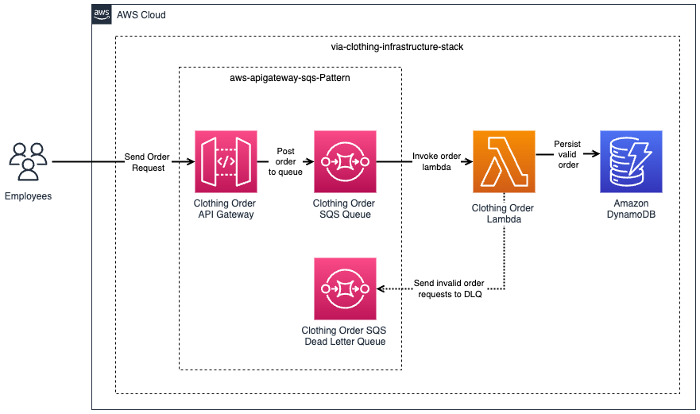

# via-clothing-cdk

This repository contains the code example of the article <i>Java All-In</i>. The infrastructure code is located in the subfolder `via-clothing-infrastructure`. The application code (for the AWS lambda) is located in the subfolder `via-clothing-order-service`.

